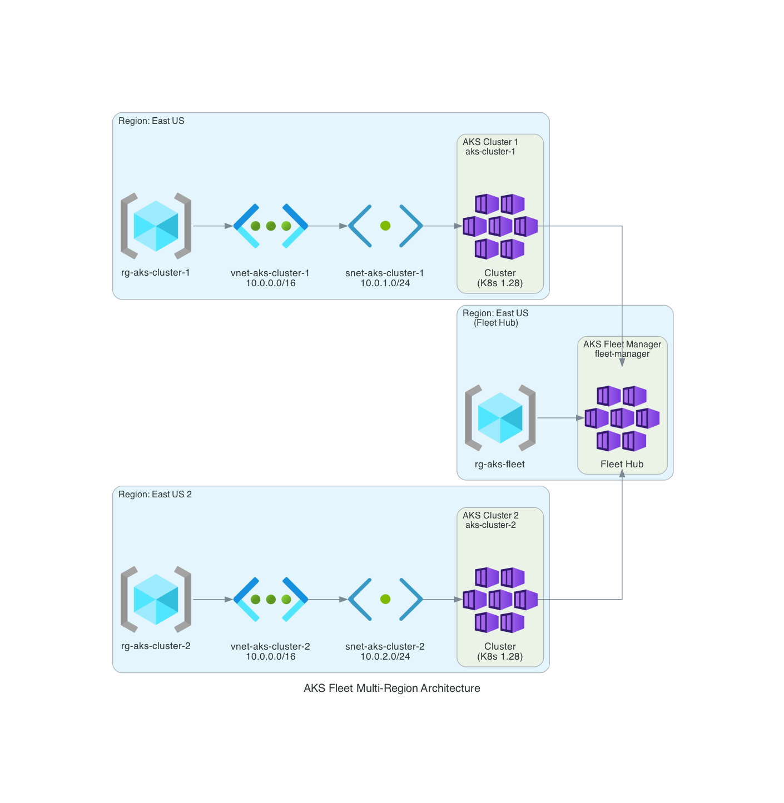
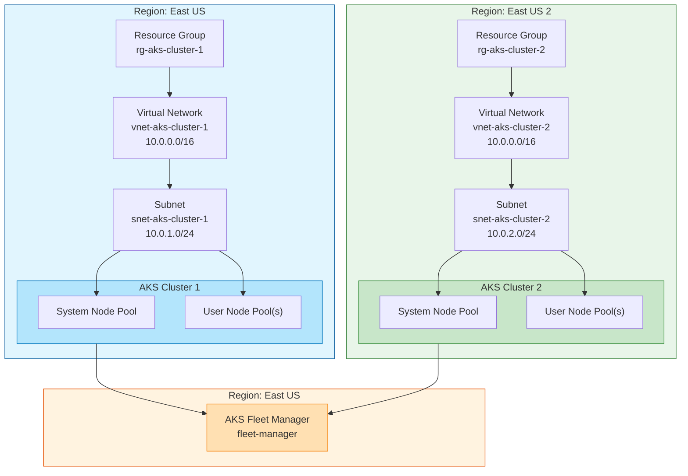

# AKS Fleet Demo - Terraform Configuration

This Terraform configuration deploys:
- 2 AKS clusters with system and user node pools
- Azure AKS Fleet Manager to manage both clusters
- Required networking infrastructure (VNet, subnets)
- Support for deploying clusters in different Azure regions

## Prerequisites

1. Azure subscription
2. Service Principal with contributor role on the subscription
3. Terraform >= 1.5.0
4. Azure CLI (for getting credentials)

## Directory Structure

```
terraform/
├── .gitignore
├── environments/
│   └── dev/
│       ├── main.tf              # Main configuration
│       ├── providers.tf         # Provider configuration
│       ├── variables.tf         # Input variables
│       ├── outputs.tf           # Output values
│       ├── terraform.tfvars.example  # Example variables
│       └── README.md            # This file
└── modules/
    ├── aks_cluster/             # AKS cluster module
    │   ├── main.tf
    │   ├── variables.tf
    │   └── outputs.tf
    └── fleet_manager/           # AKS Fleet Manager module
        ├── main.tf
        ├── variables.tf
        └── outputs.tf
```

## Architecture Diagram



The diagram above shows:
- **Region: East US** - AKS Cluster 1 with its resource group, VNet, and subnet
- **Region: East US 2** - AKS Cluster 2 with its resource group, VNet, and subnet  
- **Region: East US (Fleet Hub)** - AKS Fleet Manager connecting both clusters

## Usage

### 1. Set up Azure credentials

Option A - Environment variables:
```bash
export ARM_SUBSCRIPTION_ID="your-subscription-id"
export ARM_TENANT_ID="your-tenant-id"
export ARM_CLIENT_ID="your-client-id"
export ARM_CLIENT_SECRET="your-client-secret"
```

Option B - Azure CLI:
```bash
az login
az account set --subscription="your-subscription-id"
```

### 2. Configure variables

Copy the example variables file and update with your values:
```bash
cd terraform/environments/dev
cp terraform.tfvars.example terraform.tfvars
```

Edit `terraform.tfvars` with your Azure subscription details.

### 3. Initialize Terraform

```bash
cd terraform/environments/dev
terraform init
```

### 4. Validate the configuration

```bash
terraform validate
```

### 5. Plan the deployment

```bash
terraform plan -out=tfplan
```

### 6. Apply the configuration

```bash
terraform apply tfplan
```

## Post-deployment

### Get cluster credentials

```bash
# Cluster 1 (East US)
az aks get-credentials --name aks-cluster-1 --resource-group rg-aks-cluster-1

# Cluster 2 (East US 2)
az aks get-credentials --name aks-cluster-2 --resource-group rg-aks-cluster-2
```

### Verify the clusters

```bash
kubectl cluster-info
kubectl get nodes -A
```

### Check Fleet Manager

```bash
# View Fleet resources
kubectl get fleets --all-namespaces
kubectl get fleetclusters --all-namespaces
```

## Customization

### Adding more user node pools

Edit `cluster_1_additional_user_pools` or `cluster_2_additional_user_pools` in `main.tf`:

```hcl
cluster_1_additional_user_pools = [
  {
    name       = "gpu-pool"
    vm_size    = "Standard_NC4as_T4_v3"
    node_count = 0
    min_count  = 0
    max_count  = 2
  }
]
```

### Changing cluster sizes

Modify the `system_node_pool` or `user_node_pools` variables in `terraform.tfvars`:

```hcl
system_node_pool = {
  name       = "systempool"
  vm_size    = "Standard_D4s_v3"  # Larger size
  node_count = 3                  # More nodes
  min_count  = 2
  max_count  = 5
}
```

### Deploying to different regions

Configure cluster locations in `terraform.tfvars`:

```hcl
aks_cluster_1 = {
  name                = "aks-cluster-1"
  location            = "eastus"      # US East
  resource_group_name = "rg-aks-cluster-1"
  kubernetes_version  = "1.28"
}

aks_cluster_2 = {
  name                = "aks-cluster-2"
  location            = "westus2"     # US West 2
  resource_group_name = "rg-aks-cluster-2"
  kubernetes_version  = "1.28"
}
```

## Clean up

```bash
terraform destroy
```

**Note**: Fleet member clusters must be removed from the Fleet before destroying. Use:
```bash
az fleet member delete --fleet-name fleet-manager --name aks-cluster-1 -g rg-aks-cluster-1
az fleet member delete --fleet-name fleet-manager --name aks-cluster-2 -g rg-aks-cluster-2
```

## Architecture

### Mermaid Diagram



### ASCII Diagram

```
┌────────────────────────────────────────────────────────────────────────────────┐
│                           AKS Fleet Multi-Region Deployment                     │
├────────────────────────────────────────────────────────────────────────────────┤
│                                                                                 │
│  ┌──────────────────────────────────┐    ┌──────────────────────────────────┐  │
│  │       Region: East US            │    │      Region: East US 2           │  │
│  │                                  │    │                                   │  │
│  │  ┌────────────────────────────┐  │    │  ┌────────────────────────────┐  │  │
│  │  │ Resource Group            │  │    │  │ Resource Group             │  │  │
│  │  │ rg-aks-cluster-1          │  │    │  │ rg-aks-cluster-2           │  │  │
│  │  └────────────────────────────┘  │    │  └────────────────────────────┘  │  │
│  │                                  │    │                                   │  │
│  │  ┌────────────────────────────┐  │    │  ┌────────────────────────────┐  │  │
│  │  │ Virtual Network           │  │    │  │ Virtual Network            │  │  │
│  │  │ vnet-aks-cluster-1        │  │    │  │ vnet-aks-cluster-2         │  │  │
│  │  │ 10.0.0.0/16               │  │    │  │ 10.0.0.0/16                │  │  │
│  │  └────────────────────────────┘  │    │  └────────────────────────────┘  │  │
│  │              │                    │    │              │                     │  │
│  │  ┌──────────▼──────────────────┐│    │  ┌──────────▼──────────────────┐│  │
│  │  │ Subnet                        ││    │  │ Subnet                     ││  │
│  │  │ snet-aks-cluster-1            ││    │  │ snet-aks-cluster-2         ││  │
│  │  │ 10.0.1.0/24                   ││    │  │ 10.0.2.0/24                ││  │
│  │  └──────────────────────────────┘│    │  └─────────────────────────────┘│  │
│  │                                  │    │                                   │  │
│  │  ┌──────────────────────────────┐│    │  ┌──────────────────────────────┐│  │
│  │  │     AKS Cluster 1            ││    │  │     AKS Cluster 2            ││  │
│  │  │ ┌────────────────────────┐   ││    │  │ ┌────────────────────────┐   ││  │
│  │  │ │ System Node Pool      │   ││    │  │ │ System Node Pool      │   ││  │
│  │  │ │ (DS2_v2, 1-3 nodes)    │   ││    │  │ │ (DS2_v2, 1-3 nodes)    │   ││  │
│  │  │ └────────────────────────┘   ││    │  │ └────────────────────────┘   ││  │
│  │  │ ┌────────────────────────┐   ││    │  │ ┌────────────────────────┐   ││  │
│  │  │ │ User Node Pool(s)      │   ││    │  │ │ User Node Pool(s)      │   ││  │
│  │  │ │ (DS2_v2, 1-3 nodes)    │   ││    │  │ │ (DS2_v2, 1-3 nodes)    │   ││  │
│  │  │ └────────────────────────┘   ││    │  │ └────────────────────────┘   ││  │
│  │  └──────────────────────────────┘│    │  └───────────────────────────────┘│  │
│  └──────────────┬───────────────────┘    └───────────────┬───────────────────┘  │
│                 │                                          │                      │
│                 │                                          │                      │
│                 └────────────────┬─────────────────────────┘                      │
│                                  ▼                                                 │
│                    ┌─────────────────────────────────┐                            │
│                    │    AKS Fleet Manager             │                            │
│                    │    Region: East US               │                            │
│                    │    Hub FQDN: *.hcp.eus.azmk8s.io │                            │
│                    └─────────────────────────────────┘                            │
│                                                                                    │
└────────────────────────────────────────────────────────────────────────────────────┘
```

### Component Details

| Component | Region | Description |
|-----------|--------|-------------|
| `aks-cluster-1` | East US | Primary AKS cluster |
| `aks-cluster-2` | East US 2 | Secondary AKS cluster |
| `fleet-manager` | East US | Fleet hub for multi-cluster management |
| `rg-aks-cluster-1` | East US | Resource group for cluster 1 |
| `rg-aks-cluster-2` | East US 2 | Resource group for cluster 2 |
| `rg-aks-fleet` | East US | Resource group for Fleet Manager |

## Security Considerations

1. **RBAC**: Azure AD integration is enabled by default
2. **Network**: Clusters use Azure CNI with private networking
3. **Secrets**: Key Vault secrets provider is enabled
4. **Monitoring**: Azure Monitor metrics are enabled
5. **Identity**: System-assigned managed identities are used
